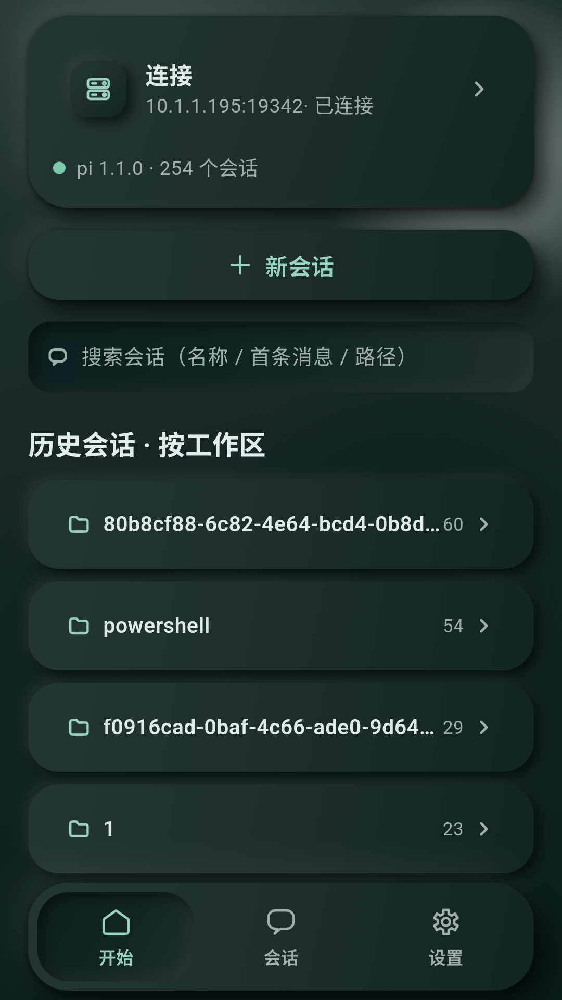
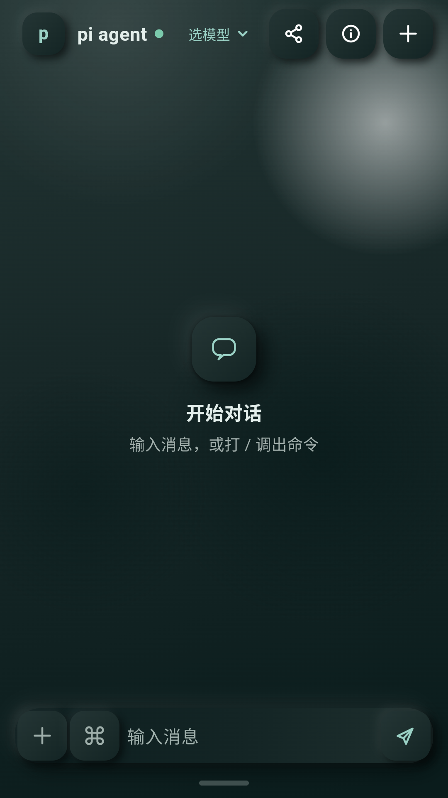
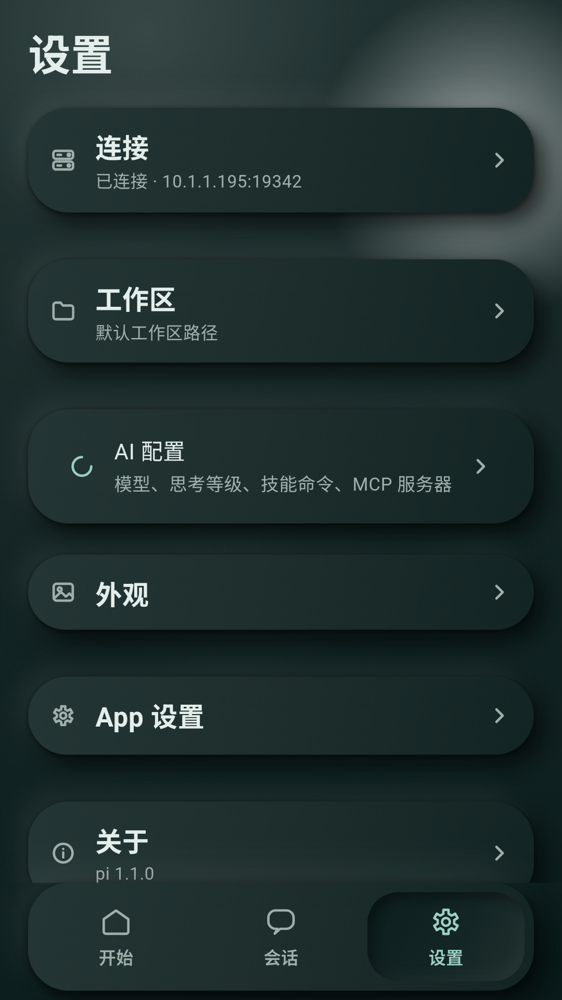
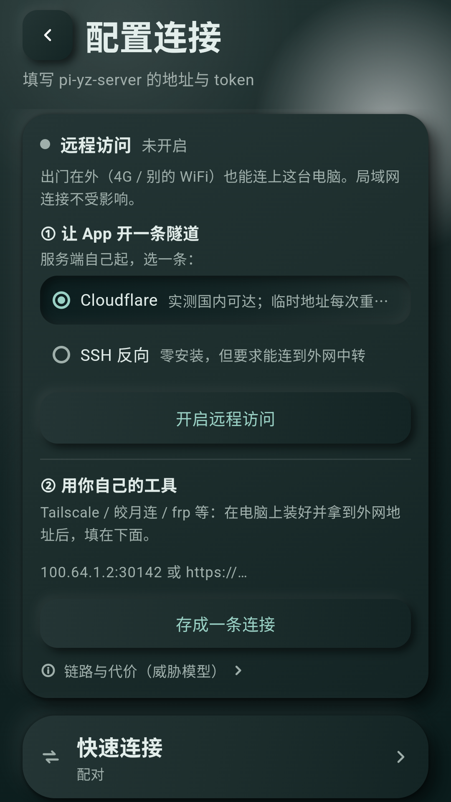
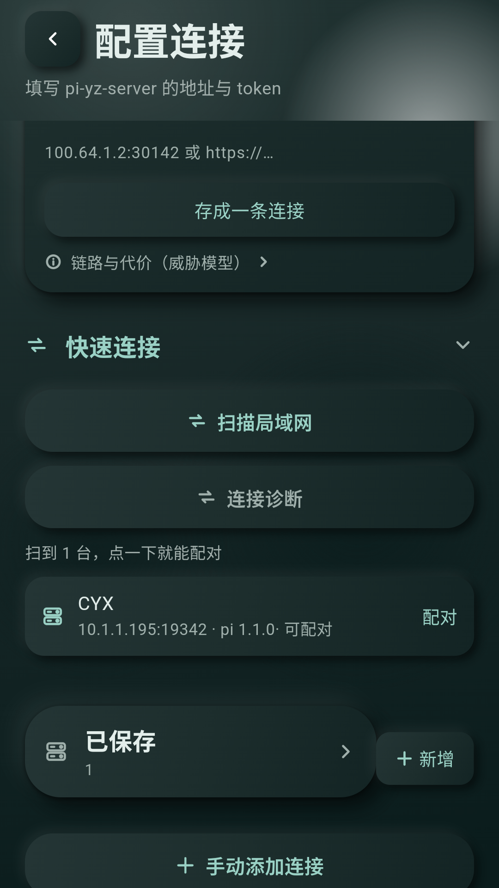

# pi-yz

在手机上用你电脑上的 pi。

pi 跑在电脑上，手机只当显示器和键盘。斜杠命令、扩展、分支树、主题这些能力本来就在 pi 里，所以客户端没有为每个功能重写一遍。



## 怎么用

需要 **Node ≥ 22.19**（pi 的要求）和 **pi 本体 + 已登录**。服务端把 pi 的 SDK 当库调用，不用开着 pi 界面。

```bash
# 电脑上，两条命令
npm install -g --ignore-scripts @earendil-works/pi-coding-agent
pi                    # 进去后跑 /login：连订阅，或填一家服务商的 API key

cd server && npm install && npm start
```

服务端起来后会打印局域网地址、token 和 6 位配对码。手机上装 APK，进「连接」→ 配对，填那个 6 位码就行。

服务端有两个拿法：**仓库源码**里的 `server/` 目录，或者 Releases 里的 `pi-yz-server-0.2.0.tgz`（66 kB，只有源码，`npm install` 会自己把依赖装上）。

Windows 上双击 `server/start.cmd` 也可以。想在任意目录一条命令启动，先 `cd server && npm link`，之后 `pi-yz` 就是它（`pi-yz --help` 看参数）。

手机 App 从 Releases 下 `arm64-v8a` 那个包（不确定架构就下 universal）。

## 长什么样

| | |
|---|---|
|  |  |
| 对话。斜杠命令、思考等级、工具调用都在这里 | 设置。连接、工作区、AI 配置、外观 |
|  |  |
| 连接与远程访问。出门在外走隧道，不用手动切地址 | 局域网里自动发现电脑，不用手填 IP |

配对不广播 token：配对码只在你于电脑端打开窗口后的 5 分钟内有效，且一次性。

## 项目结构

```
lib/                 Flutter 客户端
  ui/                  界面（chat / conn / sessions / files / config / settings）
  server/              状态与通信：server_store 是状态中枢，chat_reducer 把 SSE 事件归约成界面状态
  theme/               拟物风格主题
server/              Node 服务端，把 pi 的 SDK 包成 HTTP + SSE
  index.mjs            入口与路由
  lib/                 按能力分的模块（会话、命令、SSE、隧道、用量…）
android/             Android 工程（含 token 的 Keystore 实现）
test/                Flutter 测试
docs/                文档与截图
```

客户端不实现功能，只做显示和转发。加功能通常只需要动服务端，客户端自动就能用。

## 它不做什么

- **不是云端服务**。pi 和你的代码始终在你自己的电脑上，服务端只监听你的局域网。
- **不是独立的 agent**。它只是 pi 的遥控器，模型、认证、扩展都还是 pi 那一套。

安全边界（能防什么、防不住什么）写在 [SECURITY.md](SECURITY.md)。

## 开发

```bash
flutter pub get
flutter test                      # Flutter 侧
cd server && node --test          # 服务端侧
```

改代码、提 PR 请看 [CONTRIBUTING.md](CONTRIBUTING.md)。

## 许可

[MIT](LICENSE)
